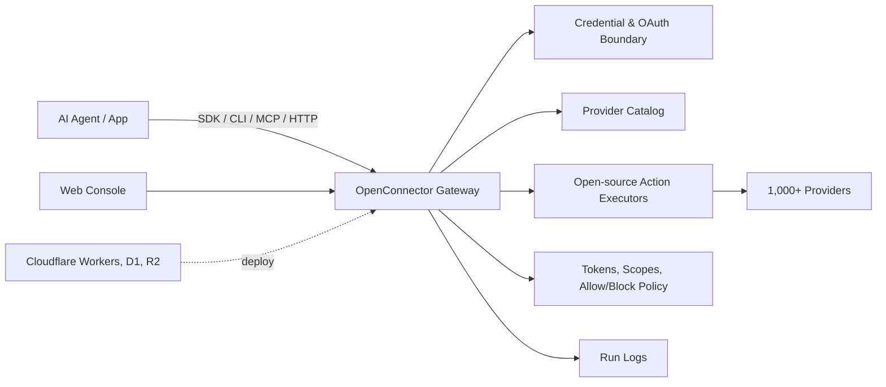

<div align="center">


[English](../README.md) | [简体中文](README.zh-CN.md) | [繁體中文](README.zh-TW.md) | [日本語](README.ja.md) | [한국어](README.ko.md) | [Русский](README.ru.md) | [Français](README.fr.md)

[](../LICENSE.txt)


[](https://oomol.com/apps)
[](https://oomol.com/apps)

</div>

OpenConnector est un connector gateway open source pour AI agents, et une alternative à Pipedream/Composio.
Connectez les comptes d'apps utilisateur une fois, puis exposez un catalog partagé de 1,000+
providers et 10 000+ Actions prêtes à l'emploi aux agents et applications.

<table>
  <tr>
    <td width="33.33%" align="center"></td>
    <td width="33.33%" align="center"></td>
    <td width="33.33%" align="center"></td>
  </tr>
  <tr>
    <td width="33.33%" valign="top">OAuth géré et runtime hébergé, prêts à l'emploi. Aucun déploiement ni configuration d'app OAuth.</td>
    <td width="33.33%" valign="top">Exécutez OpenConnector en local ou sur votre infrastructure avec Docker ou Node.js. Vous gérez le stockage et les apps OAuth.</td>
    <td width="33.33%" valign="top"><strong>Cloudflare</strong>, <strong>Fly.io</strong>, <strong>RepoCloud</strong> et plus.</td>
  </tr>
  <tr>
    <td width="33.33%" align="center">🚀 <a href="https://oomol.com/docs/connector-saas/"><strong>OOMOL hébergé</strong></a></td>
    <td width="33.33%" align="center"><a href="https://oomol.com/docs/openconnector-self-hosting/"><strong>Auto-héberger</strong></a></td>
    <td width="33.33%" align="center"><a href="deployment-options/README.fr.md"><strong>Autres plateformes</strong></a></td>
  </tr>
</table>

Utilisez le [Connector SDK](https://github.com/oomol-lab/connector-sdk) dans le code applicatif,
[oo CLI](https://github.com/oomol-lab/oo-cli) comme relais pour les agents locaux, MCP pour les
hosts d'agents, HTTP/OpenAPI pour les clients personnalisés, et la Web Console locale pour
l'administration et le débogage.

- Gardez credentials, scopes, schemas, policies et run logs dans un runtime inspectable.
- Exécutez-le en local, sur votre infrastructure ou via le runtime hébergé d'OOMOL.
- Utilisez les mêmes provider ids, Action ids, schemas et contracts entre les déploiements open
  source et SaaS commercial.

## Ce Qu'il Fournit

- Un connector catalog prêt à l'emploi couvrant GitHub, Gmail, Notion, BigQuery, Google Analytics,
  Supabase, Airtable, Slack et d'autres produits.
- Une gestion centralisée des credentials dans un seul runtime : API keys, OAuth2, custom
  credentials et providers sans authentification.
- Des Action contracts inspectables et extensibles : request/response schemas, required scopes et
  executor source chargé à la demande.
- Des runtime controls pour la production : connection identity, scopes, runtime tokens, action
  allow/block policies, transit temporaire de fichiers et journaux d'exécution masqués.
- Des options de déploiement via Docker ou Node.js en local, ou le runtime hébergé d'OOMOL. Les
  autres plateformes gérées sont listées dans les [options de déploiement](deployment-options/README.fr.md).

## Où L'utiliser

OpenConnector convient aux produits où les agents ont besoin d'un accès durable aux outils des
utilisateurs sans donner les provider credentials au processus agent.

- Produits d'agents qui nécessitent un accès réutilisable aux apps de travail, outils développeur,
  systèmes de données, plateformes de communication et services d'IA.
- Produits ajoutant des workflows d'agents et ayant besoin d'Action contracts stables et
  inspectables pour accéder aux applications des utilisateurs.
- Équipes qui veulent commencer vite avec hosted auth tout en gardant une voie vers un runtime privé
  ou self-hosted.

## Outils Développeur

| Outil                                                       | Rôle                                                                                                                                                                                           |
| ----------------------------------------------------------- | ---------------------------------------------------------------------------------------------------------------------------------------------------------------------------------------------- |
| [Connector SDK](https://github.com/oomol-lab/connector-sdk) | Client HTTP TypeScript léger. Utilisez `OpenConnector` pour un runtime self-hosted, et `Connector` / `ProjectConnector` pour les connexions personnelles et SaaS end-user hébergées par OOMOL. |
| [oo CLI](https://github.com/oomol-lab/oo-cli)               | Relais de connector Actions pour agents locaux. `oo connector` peut chercher, inspecter et exécuter des Actions sur les runtimes OOMOL-hosted ou OpenConnector self-hosted.                    |
| MCP                                                         | Exposer les Actions d'app à des hosts d'agents compatibles MCP via `http://localhost:3000/mcp`.                                                                                                |
| HTTP / OpenAPI                                              | Appeler directement `/v1/actions/*` ou inspecter le document `/openapi.json` généré.                                                                                                           |

Consultez [runtime-api.md](runtime-api.md) pour les endpoints, response envelopes, auth headers,
outils MCP et exemples d'Action guide.

## Aperçu du Dashboard

OpenConnector inclut un Dashboard local pour parcourir les connectors, configurer les credentials,
créer des runtime tokens et inspecter l'usage du runtime.

### Connector Catalog

Le connector catalog permet de voir les services disponibles, de rechercher des providers et
d'ouvrir leurs Actions et leur credential setup depuis un seul endroit.


### Usage Overview

Après le déploiement, la page Overview affiche le runtime readiness, les providers disponibles, les
Actions exécutables, les failures récentes, les tool call trends et les recent calls.


Les noms et marques des providers appartiennent à leurs propriétaires respectifs et sont utilisés
uniquement à des fins d'identification et d'interopérabilité.

## Fonctionnement



Les apps et agents découvrent les Actions, inspectent les schemas et scopes, sélectionnent un
connection alias et exécutent via le gateway. Les provider secrets restent derrière la frontière du
runtime ; les agents reçoivent les metadata, labels de compte sûrs et résultats d'exécution
nécessaires à la run.

## Parcours D'utilisation

| Parcours                    | Idéal pour                                                          | Inclus                                                                                                                                                                           |
| --------------------------- | ------------------------------------------------------------------- | -------------------------------------------------------------------------------------------------------------------------------------------------------------------------------- |
| Open source self-host       | Développeurs et équipes qui veulent un contrôle total               | Runtime Docker ou Node local, stockage SQLite, MCP, HTTP, OpenAPI et Web Console                                                                                                 |
| [OOMOL](https://oomol.com/) | Équipes bloquées par l'approbation OAuth ou les délais de lancement | Auth hébergée et infrastructure runtime avec les mêmes provider et Action contracts ; compatible avec l'interface open source pour un déploiement privé ou self-hosted ultérieur |

## Démarrage Rapide

> [!NOTE]
> Ces étapes démarrent un runtime self-hosted. Les providers OAuth nécessitent les OAuth client
> credentials des apps que vous enregistrez auprès de ces providers. Pour permettre aux
> utilisateurs d'autoriser les providers pris en charge sans configurer vos propres apps OAuth,
> utilisez les [connectors hébergés par OOMOL](https://oomol.com/apps).

Démarrez le runtime depuis l'image publiée avec Docker Compose :

```bash
docker compose up
```

Cela récupère `ghcr.io/oomol-lab/open-connector:latest`. Pour builder depuis les sources :

```bash
docker compose -f docker-compose.yml -f docker-compose.build.yml up --build
```

Ouvrez la console locale et la référence API générée :

```text
http://localhost:3000
http://localhost:3000/docs
```

Exécutez une Action sans authentification pour vérifier le runtime :

```bash
curl -s -X POST http://localhost:3000/v1/actions/hackernews.get_top_stories \
  -H 'content-type: application/json' \
  -d '{"input":{}}'
```

Consultez [quickstart.md](quickstart.md) pour la configuration locale complète, la première
connexion provider, le flux OAuth et les paramètres runtime.

## Connecter Un Provider

GitHub est l'exemple authentifié le plus simple, car il peut utiliser un personal access token :

```bash
curl -s -X PUT http://localhost:3000/api/connections/github \
  -H 'content-type: application/json' \
  -d '{"authType":"api_key","values":{"apiKey":"github_pat_..."}}'

curl -s -X POST http://localhost:3000/v1/actions/github.get_current_user \
  -H 'content-type: application/json' \
  -d '{"input":{}}'
```

Pour les apps OAuth2, named connections, credential encryption, token refresh et action policies,
consultez [credentials.md](credentials.md) et [configuration.md](configuration.md).

## Web Console

Ouvrez `http://localhost:3000` après le démarrage du runtime. La console permet de parcourir les
providers, configurer les API keys et OAuth clients, créer des runtime tokens, inspecter les Action
schemas, déboguer les Actions, revoir les exécutions récentes et accéder aux metadata OpenAPI et MCP
générées.

## Image Docker (GHCR)

Exécutez OpenConnector depuis une image préconstruite sur GitHub Packages (GHCR) :
`ghcr.io/oomol-lab/open-connector`. Utilisez `latest` pour la dernière release, une version de release
épinglée en production, ou `tip` pour le dernier build de `main`.

Consultez [docker-ghcr.md (anglais)](docker-ghcr.md) pour les tags d'image, le pull et l'exécution.

## Construire un Agent desktop avec Wanta

OpenConnector et [Wanta](https://github.com/oomol-lab/wanta) sont deux projets open source pour les
Agents IA dans l'écosystème OOMOL. OpenConnector connecte les Agents à des services externes comme
Gmail, Slack et Notion. Wanta fournit une application Agent desktop complète propulsée par OpenCode
et utilise OpenConnector pour accéder aux services SaaS connectés.

- **Exécution locale :** utilisez votre propre modèle compatible OpenAI sans créer de compte Wanta.
- **Développement personnalisé :** forkez Wanta et adaptez prompts, outils, interface, modèles et
  identité.
- **Services hébergés :** l'expérience [hébergée](https://wanta.ai/), facultative, fournit modèles
  gérés, connexions OAuth et espaces d'équipe.

Issues et pull requests sont les bienvenues.

## Documentation

- [Démarrage rapide](quickstart.md)
- [Outils développeur](sdk-cli.md)
- [Tutoriel Gmail OAuth et SDK (anglais)](gmail-oauth-sdk.md)
- [Runtime API et MCP](runtime-api.md)
- [Options de déploiement](deployment-options/README.fr.md)
- [Déploiement Fly.io](fly-io.md)
- [Déploiement Cloudflare](cloudflare.md)
- [Image Docker (GHCR) (anglais)](docker-ghcr.md)
- [Configuration](configuration.md)
- [Credentials et OAuth](credentials.md)
- [Format du catalog](catalog-format.md)
- [Langage de verification](verification.md)
- [Contribution](../CONTRIBUTING.md)
- [Code de conduite](../CODE_OF_CONDUCT.md)
- [Sécurité](../SECURITY.md)

## Développement

Utilisez Node.js 22 ou plus récent :

```bash
npm install
npm run dev
```

Le runtime API local écoute sur `http://localhost:3000`. Le serveur de développement Web Console
écoute sur `http://localhost:5173` et proxy les requêtes API vers le runtime.

Avant d'ouvrir une pull request :

```bash
npm run fix-check
npm test
```

Le code provider se trouve dans `src/providers/<service>`. Consultez
[CONTRIBUTING.md](../CONTRIBUTING.md#adding-providers) pour les règles de contribution des
providers.

## Portée De La Licence

Sauf indication contraire, le code source, les scripts, les échafaudages de projet générés, les
tests et la documentation rédigés pour ce repository sont sous Apache License, Version 2.0. Consultez
[LICENSE.txt](../LICENSE.txt).

La licence Apache-2.0 de ce repository n'accorde aucun droit sur les produits, providers, apps,
APIs, trademarks, service marks, trade names, logos, icons, brand assets, documentation,
screenshots ou autres contenus protégés appartenant à leurs détenteurs respectifs.

Les noms de providers et d'apps, metadata, liens, scopes, permissions et logos/icons optionnels sont
inclus uniquement pour identifier les services et permettre l'interopérabilité. Tous les droits sur
les marques et produits tiers restent la propriété de leurs détenteurs respectifs. Leur présence
dans ce catalog n'implique aucune approbation, sponsorisation, partenariat, certification ou
vérification par ces détenteurs.

Si vous contribuez des provider metadata ou assets, soumettez uniquement des éléments pour lesquels
vous avez les droits nécessaires. Préférez les liens vers les assets publics officiels plutôt que de
copier des fichiers de marque dans ce repository.

## Communauté

Gardez les issues et pull requests ciblées, respectueuses et actionnables. La participation à ce
projet est régie par [CODE_OF_CONDUCT.md](../CODE_OF_CONDUCT.md).

## Soutenir OpenConnector

Si OpenConnector vous est utile, attribuez-lui une ⭐ pour aider davantage de développeurs à découvrir le projet.

<div align="center">


</div>

## Contributeurs

Merci à toutes les personnes qui ont contribué à OpenConnector. Vous souhaitez les rejoindre ?
Consultez le [guide de contribution](../CONTRIBUTING.md).

[](https://github.com/oomol-lab/open-connector/graphs/contributors)

## Historique des Stars

<picture>
  <source media="(prefers-color-scheme: dark)" srcset="../assets/star-history/star-history-dark.svg">
  
</picture>
