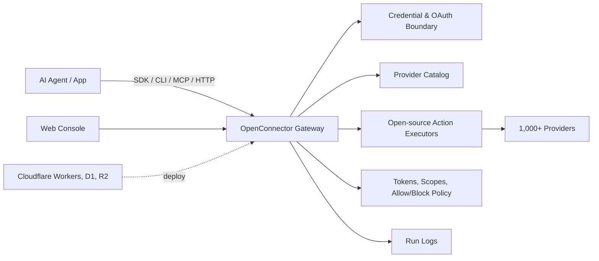

<div align="center">


[English](../README.md) | [简体中文](README.zh-CN.md) | [繁體中文](README.zh-TW.md) | [日本語](README.ja.md) | [한국어](README.ko.md) | [Русский](README.ru.md) | [Français](README.fr.md)

[](../LICENSE.txt)


[](https://oomol.com/apps)
[](https://oomol.com/apps)

</div>

OpenConnector は AI Agent 向けのオープンソース connector gateway であり、Pipedream/Composio の代替です。
ユーザーのアプリアカウントを一度接続すれば、1,000+ の provider と 10,000+ の事前定義済み Action を含む共有
catalog を Agent とアプリケーションに公開できます。

<table>
  <tr>
    <td width="33.33%" align="center"></td>
    <td width="33.33%" align="center"></td>
    <td width="33.33%" align="center"></td>
  </tr>
  <tr>
    <td width="33.33%" valign="top">マネージド OAuth と hosted runtime をすぐに利用できます。デプロイや OAuth app の設定は不要です。</td>
    <td width="33.33%" valign="top">Docker または Node.js を使い、ローカル環境や自分の infrastructure で実行します。storage と OAuth app は自身で管理します。</td>
    <td width="33.33%" valign="top"><strong>Cloudflare</strong>、<strong>Fly.io</strong>、<strong>RepoCloud</strong> など。</td>
  </tr>
  <tr>
    <td width="33.33%" align="center">🚀 <a href="https://oomol.com/docs/connector-saas/"><strong>OOMOL Hosted</strong></a></td>
    <td width="33.33%" align="center"><a href="https://oomol.com/docs/openconnector-self-hosting/"><strong>セルフホスト</strong></a></td>
    <td width="33.33%" align="center"><a href="deployment-options/README.ja.md"><strong>その他の platform</strong></a></td>
  </tr>
</table>

アプリコードには [Connector SDK](https://github.com/oomol-lab/connector-sdk)、ローカル
Agent の relay には [oo CLI](https://github.com/oomol-lab/oo-cli)、Agent host には
MCP、custom client には HTTP/OpenAPI、管理とデバッグにはローカル Web Console を使います。

- credential、scope、schema、policy、実行ログを検査可能な runtime 内に保持します。
- ローカル、自分の infrastructure、または OOMOL hosted runtime で実行できます。
- オープンソース版と commercial SaaS 版で同じ provider id、Action id、schema、contract を使います。

## 提供するもの

- すぐに使える connector catalog。GitHub、Gmail、Notion、BigQuery、Google Analytics、Supabase、Airtable、Slack
  などをカバーします。
- 1 つの runtime に集約された credential 管理：API key、OAuth2、custom credential、認証不要の provider。
- 検査、拡張できる Action contract：request/response schema、required scope、遅延読み込みされる executor source。
- 本番利用向けの runtime control：connection identity、scope、runtime token、action allow/block
  policy、一時ファイル転送、redacted run log。
- ローカル Docker / Node.js、および OOMOL hosted runtime へのデプロイ。その他のマネージド platform は
  [デプロイ方法](deployment-options/README.ja.md) を参照してください。

## 適している場面

OpenConnector は、provider credential を Agent process に渡さずに、Agent がユーザーの既存ツールへ継続的にアクセスする必要がある製品に適しています。

- work app、developer tool、data system、communication platform、AI service を横断して再利用可能なアクセスを必要とする
  Agent 製品。
- ユーザーアプリへのアクセスに、安定して検査可能な Action contract を必要とする Agent workflow 搭載製品。
- hosted auth で素早く始めつつ、将来的な private または self-hosted runtime control を確保したいチーム。

## 開発者向けツール

| ツール                                                      | 用途                                                                                                                                                                       |
| ----------------------------------------------------------- | -------------------------------------------------------------------------------------------------------------------------------------------------------------------------- |
| [Connector SDK](https://github.com/oomol-lab/connector-sdk) | 軽量 TypeScript HTTP client。self-hosted runtime には `OpenConnector`、OOMOL hosted personal / SaaS end-user connection には `Connector` / `ProjectConnector` を使います。 |
| [oo CLI](https://github.com/oomol-lab/oo-cli)               | ローカル Agent の connector Action relay です。`oo connector` は OOMOL hosted または self-hosted OpenConnector runtime の Action を検索、確認、実行できます。              |
| MCP                                                         | `http://localhost:3000/mcp` から MCP 対応 Agent host へ app Action を公開します。                                                                                          |
| HTTP / OpenAPI                                              | `/v1/actions/*` を直接呼び出すか、生成された `/openapi.json` document を確認します。                                                                                       |

Endpoint、response envelope、auth header、MCP tool、Action guide の例は
[runtime-api.md](runtime-api.md) を参照してください。

## Dashboard プレビュー

OpenConnector には、connectors の閲覧、credentials の設定、runtime token の作成、runtime usage
の確認に使えるローカル Dashboard が含まれます。

### Connector Catalog

Connector catalog では、利用可能な services の確認、provider の検索、Actions と credential setup
への移動を一か所から行えます。


### Usage Overview

デプロイ後は Overview page で runtime readiness、available providers、executable
Actions、recent failures、tool call trends、recent calls を確認できます。


Provider 名と商標はそれぞれの権利者に帰属し、識別と相互運用性のためにのみ使用されています。

## 仕組み



App と Agent は Action を発見し、schema と scope を確認し、connection alias を選択して gateway
経由で実行します。provider secret は runtime 境界の内側に留まり、Agent には実行に必要な metadata、安全な account label、実行結果だけが渡されます。

## 利用パス

| パス                        | 適している対象                             | 含まれるもの                                                                                                                                                        |
| --------------------------- | ------------------------------------------ | ------------------------------------------------------------------------------------------------------------------------------------------------------------------- |
| オープンソース self-host    | 完全な制御を求める開発者とチーム           | ローカル Docker または Node runtime、SQLite storage、MCP、HTTP、OpenAPI、Web Console                                                                                |
| [OOMOL](https://oomol.com/) | OAuth 承認やローンチ期限に制約があるチーム | Hosted auth と runtime infrastructure。同じ provider と Action contract を使い、後で private または self-hosted deployment へ移行できるオープンソース互換 interface |

## クイックスタート

> [!NOTE]
> 以下では self-hosted runtime を起動します。OAuth provider を使うには、各 provider で登録した
> OAuth client credential が必要です。独自の OAuth app を設定せずに、対応 provider をユーザーが
> 直接認可できるようにするには、[OOMOL hosted connectors](https://oomol.com/apps) を利用してください。

公開イメージから Docker Compose で runtime を起動します。

```bash
docker compose up
```

これは `ghcr.io/oomol-lab/open-connector:latest` を pull します。ソースからビルドする場合：

```bash
docker compose -f docker-compose.yml -f docker-compose.build.yml up --build
```

ローカル console と生成された API reference を開きます。

```text
http://localhost:3000
http://localhost:3000/docs
```

認証不要の Action を実行して runtime を確認します。

```bash
curl -s -X POST http://localhost:3000/v1/actions/hackernews.get_top_stories \
  -H 'content-type: application/json' \
  -d '{"input":{}}'
```

完全なローカルセットアップ、最初の provider connection、OAuth flow、runtime settings は
[quickstart.md](quickstart.md) を参照してください。

## Provider を接続する

GitHub は personal access token を使用できるため、最も簡単な credential 付きの例です。

```bash
curl -s -X PUT http://localhost:3000/api/connections/github \
  -H 'content-type: application/json' \
  -d '{"authType":"api_key","values":{"apiKey":"github_pat_..."}}'

curl -s -X POST http://localhost:3000/v1/actions/github.get_current_user \
  -H 'content-type: application/json' \
  -d '{"input":{}}'
```

OAuth2 app、named connection、credential encryption、token refresh、action policy については、
[credentials.md](credentials.md) と [configuration.md](configuration.md) を参照してください。

## Web Console

runtime 起動後に `http://localhost:3000` を開きます。console では provider browsing、API key と OAuth
client configuration、runtime token 作成、Action schema inspection、Action debugging、recent run review、
生成された OpenAPI と MCP metadata へのアクセスができます。

## Docker イメージ（GHCR）

事前ビルドされた Docker イメージで OpenConnector を実行できます（GitHub Packages / GHCR）：
`ghcr.io/oomol-lab/open-connector`。最新 release は `latest`、production では release version を固定、
最新の `main` build は `tip` を使います。

イメージの tag、pull、実行については [docker-ghcr.md（英語）](docker-ghcr.md) を参照してください。

## Wanta で desktop Agent を構築する

OpenConnector と [Wanta](https://github.com/oomol-lab/wanta) は、OOMOL の open-source ecosystem で
AI Agent を支える二つのプロジェクトです。OpenConnector は Gmail、Slack、Notion などの外部サービスを
Agent に接続します。Wanta は OpenCode で動作する完全な desktop Agent application で、OpenConnector
を通じて接続済み SaaS サービスを利用します。

- **ローカル実行：** Wanta account を作成せず、自分の OpenAI-compatible model を使用できます。
- **独自開発：** Wanta を fork し、prompts、tools、interface、models、branding をカスタマイズできます。
- **Hosted services：** 任意の [hosted experience](https://wanta.ai/) では、managed models、OAuth
  connections、team workspaces を利用できます。

Issue と pull request による貢献を歓迎します。

## ドキュメント

- [クイックスタート](quickstart.md)
- [開発者向けツール](sdk-cli.md)
- [Gmail OAuth と SDK チュートリアル（英語）](gmail-oauth-sdk.md)
- [Runtime API と MCP](runtime-api.md)
- [デプロイ方法](deployment-options/README.ja.md)
- [Fly.io デプロイ](fly-io.md)
- [Cloudflare デプロイ](cloudflare.md)
- [Docker イメージ（GHCR）（英語）](docker-ghcr.md)
- [設定](configuration.md)
- [Credential と OAuth](credentials.md)
- [Catalog format](catalog-format.md)
- [Verification language](verification.md)
- [コントリビューション](../CONTRIBUTING.md)
- [行動規範](../CODE_OF_CONDUCT.md)
- [セキュリティ](../SECURITY.md)

## 開発

Node.js 22 以上を使用してください。

```bash
npm install
npm run dev
```

Local API runtime は `http://localhost:3000` で待ち受けます。Web Console dev server は
`http://localhost:5173` で待ち受け、API requests を runtime に proxy します。

pull request を開く前に実行します。

```bash
npm run fix-check
npm test
```

Provider code は `src/providers/<service>` 配下にあります。Provider contribution rule は
[CONTRIBUTING.md](../CONTRIBUTING.md#adding-providers) を参照してください。

## ライセンス範囲

特に明記されていない限り、この repository の source code、script、生成された project scaffolding、test、
documentation は Apache License, Version 2.0 の下でライセンスされています。[LICENSE.txt](../LICENSE.txt) を参照してください。

この repository の Apache-2.0 license は、各権利者が所有する third-party product、provider、app、API、
trademark、service mark、trade name、logo、icon、brand asset、documentation、screenshot、その他の copyrighted
material に対する権利を付与するものではありません。

Provider と app の名称、metadata、link、scope、permission、任意の logo/icon は、service の識別と相互運用性のためだけに含まれます。
すべての third-party brand と product の権利は、それぞれの権利者に帰属します。この catalog に含まれることは、それらの権利者による承認、後援、提携、認証、検証を意味しません。

provider metadata や asset を提供する場合は、提出できる権利を持つ素材のみを含めてください。brand file
をこの repository にコピーするのではなく、公式に公開されている asset へリンクすることを優先してください。

## コミュニティ

issue と pull request は、焦点が合い、敬意があり、実行可能な内容にしてください。この project への参加には
[CODE_OF_CONDUCT.md](../CODE_OF_CONDUCT.md) が適用されます。

## OpenConnector を応援する

OpenConnector が役に立ったら、⭐ を付けていただくことで、より多くの開発者にこのプロジェクトを知ってもらえます。

<div align="center">


</div>

## コントリビューター

OpenConnector の開発にご協力いただいたすべての皆さまに感謝します。参加方法については
[コントリビューションガイド](../CONTRIBUTING.md) をご覧ください。

[](https://github.com/oomol-lab/open-connector/graphs/contributors)

## Star 履歴

<picture>
  <source media="(prefers-color-scheme: dark)" srcset="../assets/star-history/star-history-dark.svg">
  
</picture>
