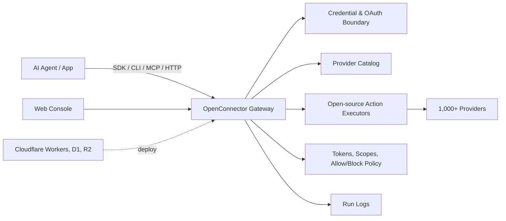

<div align="center">


[English](../README.md) | [简体中文](README.zh-CN.md) | [繁體中文](README.zh-TW.md) | [日本語](README.ja.md) | [한국어](README.ko.md) | [Русский](README.ru.md) | [Français](README.fr.md)

[](../LICENSE.txt)


[](https://oomol.com/apps)
[](https://oomol.com/apps)

</div>

OpenConnector는 AI Agent를 위한 오픈 소스 connector gateway이자 Pipedream/Composio의 대안입니다.
사용자의 앱 계정을 한 번 연결하면 1,000개 이상의 provider와 10,000개 이상의 사전 구축된 Action을
Agent와 애플리케이션에 공통 catalog로 제공할 수 있습니다.

<table>
  <tr>
    <td width="33.33%" align="center"></td>
    <td width="33.33%" align="center"></td>
    <td width="33.33%" align="center"></td>
  </tr>
  <tr>
    <td width="33.33%" valign="top">Managed OAuth와 hosted runtime을 바로 사용할 수 있습니다. 배포하거나 OAuth app을 설정할 필요가 없습니다.</td>
    <td width="33.33%" valign="top">Docker 또는 Node.js로 로컬이나 자체 인프라에서 실행합니다. Storage와 OAuth app은 직접 관리합니다.</td>
    <td width="33.33%" valign="top"><strong>Cloudflare</strong>, <strong>Fly.io</strong>, <strong>RepoCloud</strong> 등.</td>
  </tr>
  <tr>
    <td width="33.33%" align="center">🚀 <a href="https://oomol.com/docs/connector-saas/"><strong>OOMOL Hosted</strong></a></td>
    <td width="33.33%" align="center"><a href="https://oomol.com/docs/openconnector-self-hosting/"><strong>Self-host</strong></a></td>
    <td width="33.33%" align="center"><a href="deployment-options/README.ko.md"><strong>다른 플랫폼</strong></a></td>
  </tr>
</table>

애플리케이션 코드에서는 [Connector SDK](https://github.com/oomol-lab/connector-sdk), 로컬 Agent
relay에는 [oo CLI](https://github.com/oomol-lab/oo-cli), Agent host에는 MCP, custom client에는
HTTP/OpenAPI를 사용합니다. 관리와 디버깅에는 Web Console을 사용할 수 있습니다.

- Credential, scope, schema, policy, 실행 로그를 검사 가능한 runtime 내부에 보관합니다.
- 로컬, 자체 인프라 또는 OOMOL hosted runtime에서 실행할 수 있습니다.
- 오픈 소스와 상용 SaaS 배포에서 동일한 provider id, Action id, schema, contract를 사용합니다.

## 주요 기능

- GitHub, Gmail, Notion, BigQuery, Google Analytics, Supabase, Airtable, Slack 등을 지원하는
  즉시 사용 가능한 connector catalog.
- API key, OAuth2, custom credential, 인증이 필요 없는 provider를 위한 credential 관리.
- Request/response schema, required scope, 지연 로드되는 executor source를 포함하는 검사 가능한
  Action contract.
- Connection identity, scope, runtime token, Action 허용/차단 policy, 임시 파일 전송, 민감 정보가
  제거된 실행 로그를 위한 runtime 제어.
- 로컬 Docker 또는 Node.js, 그리고 OOMOL hosted runtime을 포함한 배포 방식. 추가 관리형
  platform은 [배포 옵션](deployment-options/README.ko.md)을 참조하세요.

## 적합한 사용 사례

OpenConnector는 provider credential을 Agent 프로세스에 직접 전달하지 않으면서 Agent가 사용자의 기존
도구에 지속적으로 접근해야 하는 제품에 적합합니다.

- 업무용 앱, 개발자 도구, 데이터 시스템, 커뮤니케이션 플랫폼, AI 서비스 전반에 걸쳐 재사용 가능한
  접근 계층이 필요한 Agent 제품.
- 사용자 앱에 접근할 때 안정적이고 검사 가능한 Action contract가 필요한 Agent workflow 제품.
- 빠르게 hosted auth를 시작하면서도 향후 private 또는 self-hosted runtime으로 전환할 수 있는 경로를
  유지하려는 팀.

## 개발자 도구

| 도구                                                        | 용도                                                                                                                                                                |
| ----------------------------------------------------------- | ------------------------------------------------------------------------------------------------------------------------------------------------------------------- |
| [Connector SDK](https://github.com/oomol-lab/connector-sdk) | 경량 TypeScript HTTP client. Self-hosted runtime에는 `OpenConnector`, OOMOL hosted 개인 및 SaaS 최종 사용자 연결에는 `Connector` / `ProjectConnector`를 사용합니다. |
| [oo CLI](https://github.com/oomol-lab/oo-cli)               | 로컬 Agent용 connector Action relay. `oo connector`로 OOMOL hosted 또는 self-hosted OpenConnector runtime의 Action을 검색하고 검사하고 실행할 수 있습니다.          |
| MCP                                                         | `http://localhost:3000/mcp`를 통해 앱 Action을 MCP 지원 Agent host에 제공합니다.                                                                                    |
| HTTP / OpenAPI                                              | `/v1/actions/*`를 직접 호출하거나 생성된 `/openapi.json` 문서를 확인합니다.                                                                                         |

Endpoint 세부 정보, response envelope, 인증 header, MCP tool, Action guide 예제는
[runtime-api.md](runtime-api.md)를 참조하세요.

## Dashboard 미리 보기

OpenConnector에는 connector 탐색, credential 구성, runtime token 생성, runtime 사용량 확인을 위한
로컬 Dashboard가 포함되어 있습니다.

### Connector Catalog

Connector catalog에서 사용 가능한 서비스를 확인하고 provider를 검색하며 Action과 credential 설정을
한곳에서 열 수 있습니다.


### 사용량 개요

배포 후 Overview 페이지에서 runtime 준비 상태, 사용 가능한 provider, 실행 가능한 Action, 최근 오류,
tool call 추이, 최근 호출을 확인할 수 있습니다.


Provider 이름과 상표는 각 권리자에게 있으며, 식별과 상호 운용 목적으로만 사용됩니다.

## 작동 방식



앱과 Agent는 Action을 검색하고 schema와 scope를 검사하며 connection alias를 선택한 뒤 gateway를 통해
실행합니다. Provider secret은 runtime 경계 안에 유지되고, Agent에는 실행에 필요한 metadata, 안전한
계정 label, 실행 결과만 전달됩니다.

## 사용 경로

| 경로                            | 적합한 대상                             | 포함 항목                                                                                                                                                                           |
| ------------------------------- | --------------------------------------- | ----------------------------------------------------------------------------------------------------------------------------------------------------------------------------------- |
| 오픈 소스 self-host             | 인프라를 완전히 제어하려는 개발자와 팀  | 로컬 Docker 또는 Node runtime, SQLite storage, MCP, HTTP, OpenAPI, Web Console                                                                                                      |
| [OOMOL](https://oomol.com/apps) | 사용자가 계정을 즉시 승인하게 하려는 팀 | 지원되는 provider용 OAuth app, 매월 제공되는 Connect credits, hosted runtime 인프라. 동일한 provider 및 Action contract를 사용하므로 향후 private 또는 self-hosted 배포로 전환 가능 |

## 빠른 시작

> [!NOTE]
> 다음 단계에서는 self-hosted runtime을 시작합니다. OAuth provider를 사용하려면 해당 provider에 직접
> 등록한 OAuth app의 client credential이 필요합니다. OAuth app을 직접 구성하지 않고 사용자가 지원되는
> provider를 승인하게 하려면 [OOMOL hosted connector](https://oomol.com/apps)를 사용하세요.

배포된 이미지에서 Docker Compose로 runtime을 시작합니다.

```bash
docker compose up
```

이 명령은 `ghcr.io/oomol-lab/open-connector:latest`를 가져옵니다. 소스에서 직접 빌드하려면 다음을
실행하세요.

```bash
docker compose -f docker-compose.yml -f docker-compose.build.yml up --build
```

로컬 Console과 생성된 API reference를 엽니다.

```text
http://localhost:3000
http://localhost:3000/docs
```

인증이 필요 없는 Action을 실행하여 runtime이 정상 작동하는지 확인합니다.

```bash
curl -s -X POST http://localhost:3000/v1/actions/hackernews.get_top_stories \
  -H 'content-type: application/json' \
  -d '{"input":{}}'
```

전체 로컬 설정, 첫 provider 연결, OAuth flow, runtime 설정은 [quickstart.md](quickstart.md)를
참조하세요.

## Provider 연결

GitHub는 personal access token을 사용할 수 있어 credential이 필요한 예제로 가장 간단합니다.

```bash
curl -s -X PUT http://localhost:3000/api/connections/github \
  -H 'content-type: application/json' \
  -d '{"authType":"api_key","values":{"apiKey":"github_pat_..."}}'

curl -s -X POST http://localhost:3000/v1/actions/github.get_current_user \
  -H 'content-type: application/json' \
  -d '{"input":{}}'
```

OAuth2 app, named connection, credential 암호화, token refresh, Action policy에 대해서는
[credentials.md](credentials.md)와 [configuration.md](configuration.md)를 참조하세요.

## Web Console

npm 기반 로컬 개발에서는 `http://localhost:5173`을 엽니다. Web Console dev server는
`http://localhost:3000`의 runtime으로 API request를 proxy합니다. Docker 또는 빌드된 Node runtime에서는
Console이 `http://localhost:3000`에서 제공됩니다.

Console은 provider 탐색, API key 및 OAuth client 구성, runtime token 생성, Action schema 검사,
Action 디버깅, 최근 실행 검토, 생성된 OpenAPI 및 MCP metadata 접근을 지원합니다.

## Docker 이미지(GHCR)

GitHub Packages(GHCR)의 사전 빌드된 이미지 `ghcr.io/oomol-lab/open-connector`로 OpenConnector를
실행할 수 있습니다. 최신 release에는 `latest`, 재현 가능한 production 배포에는 고정된 release
version, 최신 `main` build에는 `tip`을 사용하세요.

Image tag, 가져오기, 실행 방법은 [docker-ghcr.md](docker-ghcr.md)를 참조하세요.

## Wanta로 데스크톱 Agent 만들기

OpenConnector와 [Wanta](https://github.com/oomol-lab/wanta)는 OOMOL 오픈 소스 생태계에서 AI Agent를
지원하는 두 프로젝트입니다. OpenConnector는 Gmail, Slack, Notion 같은 외부 서비스를 Agent에 연결합니다.
Wanta는 OpenCode로 실행되는 완전한 데스크톱 Agent 애플리케이션이며, OpenConnector를 통해 연결된 SaaS
서비스를 사용합니다.

- **로컬 실행:** Wanta 계정 없이 자신의 OpenAI 호환 모델을 사용할 수 있습니다.
- **직접 개발:** Wanta를 fork하여 prompt, 도구, 인터페이스, 모델, branding을 맞춤 설정할 수 있습니다.
- **호스팅 서비스:** 선택 사항인 [호스팅 환경](https://wanta.ai/)은 managed model, OAuth 연결, 팀
  workspace를 제공합니다.

Issue와 pull request를 통한 기여를 환영합니다.

## 문서

- [빠른 시작](quickstart.md)
- [개발자 도구](sdk-cli.md)
- [Gmail OAuth 및 SDK 튜토리얼(영문)](gmail-oauth-sdk.md)
- [Runtime API 및 MCP](runtime-api.md)
- [배포 옵션](deployment-options/README.ko.md)
- [Fly.io 배포](fly-io.md)
- [Cloudflare 배포](cloudflare.md)
- [Docker 이미지(GHCR)](docker-ghcr.md)
- [구성](configuration.md)
- [Credential 및 OAuth](credentials.md)
- [Catalog 형식](catalog-format.md)
- [검증 언어](verification.md)
- [기여 안내](../CONTRIBUTING.md)
- [행동 강령](../CODE_OF_CONDUCT.md)
- [보안](../SECURITY.md)

## 개발

Node.js 22 이상을 사용하세요.

```bash
npm install
npm run dev
```

로컬 API runtime은 `http://localhost:3000`에서 실행됩니다. Web Console dev server는
`http://localhost:5173`에서 실행되며 API request를 runtime으로 proxy합니다.

Pull request를 열기 전에 다음을 실행하세요.

```bash
npm run fix-check
npm test
```

Provider 코드는 `src/providers/<service>`에 있습니다. Provider 기여 규칙은
[CONTRIBUTING.md](../CONTRIBUTING.md#adding-providers)를 참조하세요.

## 라이선스 범위

별도로 명시하지 않는 한 이 repository를 위해 작성된 source code, script, 생성된 project scaffolding,
test, 문서는 Apache License Version 2.0에 따라 사용이 허가됩니다.
[LICENSE.txt](../LICENSE.txt)를 참조하세요.

이 repository의 Apache-2.0 license는 각 권리자가 소유한 타사 제품, provider, app, API, 상표,
service mark, trade name, logo, icon, brand asset, 문서, screenshot 또는 기타 저작물에 대한 권리를
부여하지 않습니다.

Provider와 app 이름, metadata, link, scope, permission, 선택적 logo/icon은 서비스를 식별하고 상호
운용성을 제공하기 위한 목적으로만 포함됩니다. 모든 타사 brand 및 제품 권리는 각 권리자에게 있습니다.
Catalog에 포함되었다고 해서 해당 권리자의 보증, 후원, 파트너십, 인증 또는 검증을 의미하지 않습니다.

Provider metadata나 asset을 기여할 때는 제출할 권리가 있는 자료만 포함하세요. Brand file을 복사하는
대신 공식 공개 asset에 연결하는 방식을 우선하세요.

## 커뮤니티

Issue와 pull request는 주제에 집중하고 서로 존중하며 실행 가능하게 작성해 주세요. 이 프로젝트 참여에는
[CODE_OF_CONDUCT.md](../CODE_OF_CONDUCT.md)가 적용됩니다.

## OpenConnector 지원하기

OpenConnector가 유용했다면 ⭐를 눌러 주세요. 더 많은 개발자가 이 프로젝트를 발견하는 데 도움이 됩니다.

<div align="center">


</div>

## 기여자

OpenConnector를 함께 만들어 주신 모든 기여자께 감사드립니다.
[기여 안내](../CONTRIBUTING.md)를 확인하고 함께해 주세요.

[](https://github.com/oomol-lab/open-connector/graphs/contributors)

## Star 히스토리

<picture>
  <source media="(prefers-color-scheme: dark)" srcset="../assets/star-history/star-history-dark.svg">
  
</picture>
