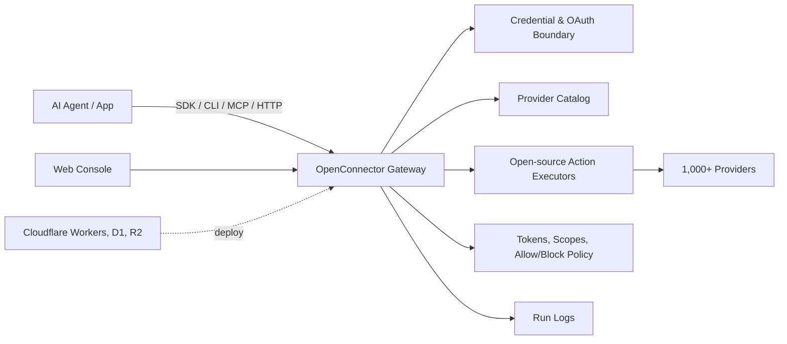
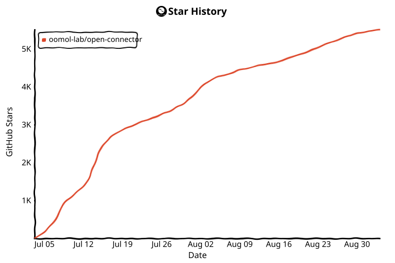

<div align="center">


[English](../README.md) | [简体中文](README.zh-CN.md) | [繁體中文](README.zh-TW.md) | [日本語](README.ja.md) | [한국어](README.ko.md) | [Русский](README.ru.md) | [Français](README.fr.md)

[](../LICENSE.txt)


[](https://oomol.com/apps)
[](https://oomol.com/apps)

</div>

OpenConnector 是一套供 AI Agent 使用的開放原始碼連接器閘道，也是 Pipedream/Composio 的替代方案。
只要連線一次使用者的應用程式帳號，就能向 Agent 與應用程式提供共用目錄，其中包含 1,000 多個服務提供者及 10,000 多個預先建置的 Action。

<table>
  <tr>
    <td width="33.33%" align="center"></td>
    <td width="33.33%" align="center"></td>
    <td width="33.33%" align="center"></td>
  </tr>
  <tr>
    <td width="33.33%" valign="top">代管 OAuth 與執行階段，開箱即用。無須部署或設定 OAuth 應用程式。</td>
    <td width="33.33%" valign="top">使用 Docker 或 Node.js 在本機或自己的基礎架構中執行。儲存空間與 OAuth 應用程式由你負責管理。</td>
    <td width="33.33%" valign="top"><strong>Cloudflare</strong>、<strong>Fly.io</strong>、<strong>RepoCloud</strong> 等。</td>
  </tr>
  <tr>
    <td width="33.33%" align="center">🚀 <a href="https://oomol.com/docs/connector-saas/"><strong>OOMOL 代管</strong></a></td>
    <td width="33.33%" align="center"><a href="https://oomol.com/docs/openconnector-self-hosting/"><strong>自行代管</strong></a></td>
    <td width="33.33%" align="center"><a href="deployment-options/README.zh-TW.md"><strong>更多平台</strong></a></td>
  </tr>
</table>

在應用程式程式碼中使用 [Connector SDK](https://github.com/oomol-lab/connector-sdk)，以
[oo CLI](https://github.com/oomol-lab/oo-cli) 作為本機 Agent 的轉接工具；Agent 主機可使用 MCP，
自訂用戶端可使用 HTTP/OpenAPI，而 Web 控制台則用於管理與偵錯。

- 將憑證、權限範圍、結構描述、原則及執行記錄保留在可檢視的執行階段中。
- 可在本機、自己的基礎架構，或 OOMOL 的代管執行階段上運作。
- 開放原始碼與商業 SaaS 部署共用相同的服務提供者 ID、Action ID、結構描述及合約。

## 提供的功能

- 可直接使用的連接器目錄，涵蓋 GitHub、Gmail、Notion、BigQuery、Google Analytics、Supabase、Airtable、Slack 等產品。
- 支援 API 金鑰、OAuth2、自訂憑證，以及無須驗證的服務提供者。
- 可檢視的 Action 合約：請求與回應結構描述、必要權限範圍，以及延遲載入的執行器原始碼。
- 執行階段控制功能，涵蓋連線身分、權限範圍、執行階段權杖、Action 允許/封鎖原則、暫存檔案傳輸及遮蔽敏感資料的執行記錄。
- 部署選項包括本機 Docker 或 Node.js，以及 OOMOL 的代管執行階段。其他代管平台見
  [部署方案](deployment-options/README.zh-TW.md)。

## 適用情境

OpenConnector 適合需要讓 Agent 長期存取使用者既有工具，又不想將服務提供者憑證交給 Agent 程序的產品。

- 需要在工作應用程式、開發者工具、資料系統、通訊平台及 AI 服務間重複使用存取層的 Agent 產品。
- 正在加入 Agent 工作流程，且需要以穩定、可檢視的 Action 合約存取使用者應用程式的產品。
- 想先透過代管驗證快速上線，同時保留日後改用私有或自行代管執行階段控制權的團隊。

## 開發者工具

| 工具                                                        | 用途                                                                                                                                                   |
| ----------------------------------------------------------- | ------------------------------------------------------------------------------------------------------------------------------------------------------ |
| [Connector SDK](https://github.com/oomol-lab/connector-sdk) | 輕量的 TypeScript HTTP 用戶端。自行代管的執行階段使用 `OpenConnector`；OOMOL 代管的個人及 SaaS 終端使用者連線則使用 `Connector` / `ProjectConnector`。 |
| [oo CLI](https://github.com/oomol-lab/oo-cli)               | 本機 Agent 的連接器 Action 轉接工具。`oo connector` 可在 OOMOL 代管或自行代管的 OpenConnector 執行階段中搜尋、檢視及執行 Action。                      |
| MCP                                                         | 透過 `http://localhost:3000/mcp` 向支援 MCP 的 Agent 主機提供應用程式 Action。                                                                         |
| HTTP / OpenAPI                                              | 直接呼叫 `/v1/actions/*`，或檢視產生的 `/openapi.json` 文件。                                                                                          |

端點詳細資料、回應封裝格式、驗證標頭、MCP 工具及 Action 指南範例，請參閱
[runtime-api.md](runtime-api.md)。

## 儀表板預覽

OpenConnector 內附本機儀表板，可用來瀏覽連接器、設定憑證、建立執行階段權杖及檢視執行階段使用情形。

### 連接器目錄

透過連接器目錄，可在同一處查看可用服務、搜尋服務提供者，並開啟其 Action 與憑證設定。


### 使用情形總覽

部署後可透過「總覽」頁面監控執行階段就緒狀態、可用服務提供者、可執行的 Action、近期失敗、工具呼叫趨勢及近期呼叫。


服務提供者名稱與商標均屬各自權利人所有，本專案僅將其用於識別服務及實現互通性。

## 運作方式



應用程式與 Agent 可探索 Action、檢視結構描述與權限範圍、選取連線別名，並透過閘道執行呼叫。
服務提供者密鑰會保留在執行階段邊界內；Agent 只會取得該次執行所需的中繼資料、安全的帳號標籤及執行結果。

## 使用方式

| 方式                        | 適用對象                          | 內容                                                                                                                 |
| --------------------------- | --------------------------------- | -------------------------------------------------------------------------------------------------------------------- |
| 開放原始碼、自行代管        | 想完整掌控基礎架構的開發者與團隊  | 本機 Docker 或 Node 執行階段、SQLite 儲存空間、MCP、HTTP、OpenAPI 及 Web 控制台                                      |
| [OOMOL](https://oomol.com/) | 受限於 OAuth 核准或上線期限的團隊 | 使用相同服務提供者與 Action 合約的代管驗證及執行階段基礎架構；介面與開放原始碼版本相容，日後可改用私有或自行代管部署 |

## 快速開始

> [!NOTE]
> 以下步驟會啟動自行代管的執行階段。使用 OAuth 服務提供者時，你必須提供自行向對應平台申請的
> OAuth 用戶端憑證。若希望使用者無須設定 OAuth 應用程式即可直接授權支援的服務提供者，請使用
> [OOMOL 官方代管 Connector](https://oomol.com/apps)。

使用 Docker Compose 從已發布的映像檔啟動執行階段：

```bash
docker compose up
```

此指令會拉取 `ghcr.io/oomol-lab/open-connector:latest`。若要改為從原始碼建置：

```bash
docker compose -f docker-compose.yml -f docker-compose.build.yml up --build
```

開啟本機控制台與產生的 API 參考文件：

```text
http://localhost:3000
http://localhost:3000/docs
```

執行一個無須驗證的 Action，以確認執行階段正常運作：

```bash
curl -s -X POST http://localhost:3000/v1/actions/hackernews.get_top_stories \
  -H 'content-type: application/json' \
  -d '{"input":{}}'
```

完整的本機設定、第一個服務提供者連線、OAuth 流程及執行階段設定，請參閱 [quickstart.md](quickstart.md)。

## 連線服務提供者

GitHub 是最簡單的憑證範例，因為它可以使用 Personal Access Token：

```bash
curl -s -X PUT http://localhost:3000/api/connections/github \
  -H 'content-type: application/json' \
  -d '{"authType":"api_key","values":{"apiKey":"github_pat_..."}}'

curl -s -X POST http://localhost:3000/v1/actions/github.get_current_user \
  -H 'content-type: application/json' \
  -d '{"input":{}}'
```

OAuth2 應用程式、具名連線、憑證加密、權杖更新及 Action 原則，請參閱
[credentials.md](credentials.md) 與 [configuration.md](configuration.md)。

## Web 控制台

使用 npm 在本機開發時，請開啟 `http://localhost:5173`；Web 控制台開發伺服器會將 API 請求轉送至
`http://localhost:3000` 上的執行階段。使用 Docker 或已建置的 Node 執行階段時，控制台由
`http://localhost:3000` 提供。

控制台支援瀏覽服務提供者、設定 API 金鑰與 OAuth 用戶端、建立執行階段權杖、檢視 Action 結構描述、
偵錯 Action、查看近期執行記錄，以及存取產生的 OpenAPI 與 MCP 中繼資料。

## Docker 映像檔（GHCR）

使用 GitHub Packages（GHCR）上的預先建置映像檔執行 OpenConnector：`ghcr.io/oomol-lab/open-connector`。
最新版本使用 `latest`；正式環境請固定具體的 release 版本號；若要使用最新的 `main` 建置則使用 `tip`。

標籤、拉取及執行方式，請參閱 [docker-ghcr.md（英文）](docker-ghcr.md)。

## 用 Wanta 建構你的桌面 Agent

OpenConnector 與 [Wanta](https://github.com/oomol-lab/wanta) 是 OOMOL 開源生態中面向 AI Agent
的兩個專案。OpenConnector 負責將 Gmail、Slack、Notion 等外部服務接入 Agent；Wanta 則提供一套以 OpenCode
執行的完整桌面 Agent 應用程式，並透過 OpenConnector 使用已連接的 SaaS 服務。

- **本機執行：** 使用自己的 OpenAI 相容模型，無須註冊 Wanta 帳號。
- **二次開發：** Fork Wanta，自訂提示詞、工具、介面、模型與品牌，建構自己的桌面 Agent。
- **託管服務：** 選用的[託管服務](https://wanta.ai/)提供託管模型、OAuth 連線與團隊工作區。

歡迎透過 Issue 和 Pull Request 參與貢獻。

## 文件

- [快速入門](quickstart.md)
- [開發者工具](sdk-cli.md)
- [Gmail OAuth 與 SDK 教學（英文）](gmail-oauth-sdk.md)
- [執行階段 API 與 MCP](runtime-api.md)
- [部署方案](deployment-options/README.zh-TW.md)
- [Fly.io 部署](fly-io.md)
- [Cloudflare 部署](cloudflare.md)
- [Docker 映像檔（GHCR）（英文）](docker-ghcr.md)
- [設定](configuration.md)
- [憑證與 OAuth](credentials.md)
- [目錄格式](catalog-format.md)
- [驗證用語](verification.md)
- [貢獻指南](../CONTRIBUTING.md)
- [行為準則](../CODE_OF_CONDUCT.md)
- [安全性](../SECURITY.md)

## 開發

請使用 Node.js 22 或更新版本：

```bash
npm install
npm run dev
```

本機 API 執行階段監聽 `http://localhost:3000`。Web 控制台開發伺服器監聽
`http://localhost:5173`，並將 API 請求轉送至執行階段。

建立 Pull Request 前，請執行：

```bash
npm run fix-check
npm test
```

服務提供者程式碼位於 `src/providers/<service>`。貢獻服務提供者的規則，請參閱
[CONTRIBUTING.md](../CONTRIBUTING.md#adding-providers)。

## 授權範圍

除非另有說明，本儲存庫中由專案作者撰寫的原始碼、指令碼、產生的專案鷹架、測試及文件，
均依 Apache License, Version 2.0 授權。請參閱 [LICENSE.txt](../LICENSE.txt)。

本儲存庫的 Apache-2.0 授權並未授予任何第三方產品、服務提供者、應用程式、API、商標、服務標章、
商號、標誌、圖示、品牌資產、文件、螢幕擷取畫面，或其他由其權利人擁有之著作權資料的使用權。

服務提供者及應用程式名稱、中繼資料、連結、權限範圍、權限，以及選用的標誌或圖示，僅用於識別服務及實現互通性。
所有第三方品牌與產品權利仍歸各自權利人所有。收錄於本目錄不代表該權利人認可、贊助、合作、認證或驗證本專案。

若要貢獻服務提供者中繼資料或資產，請只提交你有權提交的內容。請優先連結官方公開資產，不要將品牌檔案複製到本儲存庫。

## 社群

請確保 Issue 與 Pull Request 主題明確、尊重他人且可採取行動。參與本專案須遵守
[CODE_OF_CONDUCT.md](../CODE_OF_CONDUCT.md)。

## 支持 OpenConnector

如果 OpenConnector 對你有幫助，給個 ⭐ 能幫助更多開發者發現這個專案。

<div align="center">


</div>

## 貢獻者

感謝每一位參與建設 OpenConnector 的貢獻者。歡迎參閱 [貢獻指南](../CONTRIBUTING.md)，加入我們。

[](https://github.com/oomol-lab/open-connector/graphs/contributors)

## Star 歷史

<picture>
  <source media="(prefers-color-scheme: dark)" srcset="../assets/star-history/star-history-dark.svg">
  
</picture>
